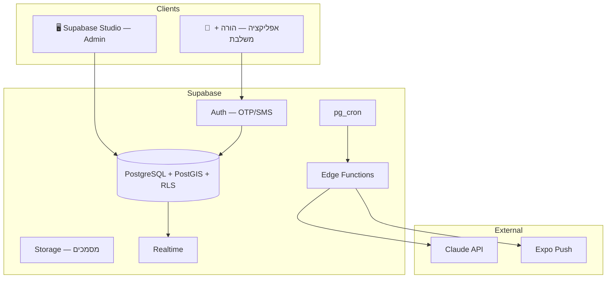

# Together — תכנית פיתוח מאוחדת

> **מסמך מאוחד** — נקודת העוגן לכל פיתוח. כל סתירה בין מסמכי מקור מוכרעת כאן.
>
> עודכן: 2026-07-07 · גרסה 2.0 — כל ההחלטות אושרו

| מסמך מקור | תפקיד |
|------|--------|
| `master_spec.html` | מפרט מוצר מלא (חזון, תהליכים, עסק) |
| `DEVELOPMENT_PLAN.md` | **מסמך מאוחד (זה) — מקור האמת לפיתוח** |

---

## חלק א׳ — החלטות מאושרות

### Stack

| נושא | בחירה | נימוק |
|------|--------|-------|
| Frontend | **React Native + Expo SDK 53** | native אמיתי, GPS, push |
| ניווט | **Expo Router** | file-based, מודרני |
| UI Kit | **NativeWind** | AI-first, Tailwind syntax, גמישות מלאה |
| State | **Zustand + TanStack Query** | Zustand ל-client state, TanStack ל-server state |
| Backend + DB | **Supabase (PostgreSQL)** | Auth + Storage + RLS + Realtime + Edge Functions |
| AI | **Claude API** | ניתוח שאלון יומי + הצעות אסטרטגיה |
| OCR | **ידני ב-MVP** → Document AI ב-v1.5 | חוסך complexity |
| התראות | **Expo Push + SMS (OTP בלבד)** | push native בלי APNs/FCM ידני |
| Admin | **Supabase Studio ב-MVP** → Next.js ב-v1.5 | אפס השקעה, מספיק ל-50 משלבות |
| שפות | **עברית + אנגלית** (i18n מיום 1) | react-i18next, RTL מובנה |
| תשלומים | **לא ב-MVP** — ספק ייבחר לפני launch | |

### Monorepo

```
toghther/
├── apps/
│   └── mobile/                 # React Native + Expo (הורה + משלבת)
│       ├── app/                 # Expo Router pages
│       │   ├── (auth)/          # Login, Register, Onboarding
│       │   ├── (parent)/        # Parent screens
│       │   ├── (professional)/  # Professional screens
│       │   ├── (active-match)/  # Post-match operations
│       │   └── _layout.tsx      # Root layout
│       ├── components/          # UI components
│       ├── hooks/               # Custom hooks
│       ├── stores/              # Zustand stores
│       ├── lib/                 # Utilities, Supabase client
│       ├── i18n/                # Translations (he, en)
│       └── assets/              # Images, fonts
├── packages/
│   ├── shared/                  # Types (Supabase gen), utils, validation
│   └── matching/                # Scoring algorithm (testable independently)
├── supabase/
│   ├── migrations/              # SQL migrations
│   ├── functions/               # Edge Functions
│   ├── seed.sql                 # Test data
│   └── config.toml              # Supabase config
├── package.json                 # Root workspace
├── master_spec.html
└── DEVELOPMENT_PLAN.md
```

---

## חלק ב׳ — ארכיטקטורה



### מודל פרטיות — 4 שכבות (TIER)

| TIER | מתי | מה נחשף |
|------|-----|---------|
| 0 | לפני בקשה (ציבורי) | שם פרטי + גיל, אזור כללי, סוג מסגרת, קטגוריית צורך, שעות |
| 1 | בקשה הוגשה | + אבחנה כללית, רמת תפקוד, תקשורת ורבלית |
| 2 | הורה אישר | + שם מלא, אבחנה מלאה, מה עובד/מקשה, פרטי קשר הורה |
| 3 | match פעיל | תיק ילד מלא, מסמכים מאושרים, יומן, audit log |

**עקרון:** `children` (TIER 0–1) ו-`child_details` (TIER 2–3) מפוצלים — RLS שונה לכל טבלה.

---

## חלק ג׳ — DB Schema

```sql
-- משתמשים (Supabase Auth + profile)
profiles          → id, role(parent|professional|admin), phone, area,
                    preferred_language, created_at

-- ילדים — TIER 0–1 (ציבורי למשלבות מאומתות)
children          → id, parent_id, first_name, age, category,
                    functioning_level, framework_type, needs jsonb,
                    communication_verbal, hours, published,
                    location geography(Point, 4326)

-- ילדים — TIER 2–3 (אחרי אישור הורה)
child_details     → child_id, full_name, diagnosis_full, what_works,
                    what_triggers, gender_preference, parent_contact,
                    documents jsonb

-- מקצוענים
professionals     → user_id, type, specialties[], certifications[],
                    availability jsonb, verified, verification_notes,
                    rating_avg, backup_available,
                    location geography(Point, 4326)

-- בקשות והתאמות
match_requests    → child_id, professional_id, status, cover_letter,
                    tier_reached, created_at
matches           → child_id, professional_id, status(active|ended),
                    score, match_reason, started_at, ended_at

-- אופרציה יומית
checkins          → match_id, location geography, created_at
daily_logs        → match_id, date, metrics jsonb, mood, ai_summary
reviews           → match_id, reviewer_role, reliability,
                    professionalism, child_fit, text

-- אבטחה ומסמכים
audit_log         → user_id, resource, action, tier, ip, created_at
document_uploads  → owner_id, type, storage_path, verified, verified_by
```

---

## חלק ד׳ — Roadmap

### MVP — 8 שבועות

| שבוע | שלב | תוכן | אחראי |
|------|-----|-------|--------|
| 1 | תשתית | DB Schema + RLS + Auth + Supabase setup + seed | **Antigravity** |
| 1–2 | עיצוב | Design System + 6 מסכי ליבה ב-Stitch | **Antigravity** |
| 2 | שלד | Expo project + NativeWind + Expo Router + i18n | **Cursor** |
| 2–3 | קליטה | פרופיל הורה + ילד + משלבת + העלאת מסמכים | **Cursor** |
| 3–5 | מנוע התאמה | Hard filters + Soft scoring + Edge Function | **Antigravity** |
| 3–5 | Match flow | מסך בית הורה + בקשה + TIER 0–2 + browse | **Cursor** |
| 5–7 | אופרציה | EVV Check-in + מיקרו-שאלון + סיכום AI + דירוג | **שניהם** |
| 8 | Launch prep | Seeding 50+ + בדיקות RLS + TestFlight | **שניהם** |

### v1.5 — עומק ואמון
- חמ"ל חירום + pool פנימי
- תיק ילד מלא + TIER 3 (מסמכים, audit log)
- personality matching — שאלון מותאם
- Admin dashboard custom (Next.js)
- OCR — Document AI

### v2 — הרחבה
- מיקרו-למידה + badge מקצועי
- כלי B2B לרכזי שילוב ובתי ספר
- מודול זכויות

### v3 — B2G
- אינטגרציה עם רשויות, מאגר גיבוי רשותי, סל שילוב ממשלתי

---

## חלק ה׳ — חלוקת אחריות

| תחום | Antigravity | Cursor |
|------|:-----------:|:------:|
| DB Schema + RLS + Migrations | ✅ | |
| Supabase Edge Functions | ✅ | |
| Matching Engine (packages/matching) | ✅ | |
| Stitch Design System + מסכים | ✅ | |
| בדיקות RLS | ✅ | |
| Expo Project Setup | | ✅ |
| NativeWind + Theme | | ✅ |
| Auth Flow + Navigation | | ✅ |
| i18n Setup | | ✅ |
| מסכי הורה + משלבת | | ✅ |
| EVV Check-in | ✅ | ✅ |
| Daily Log + AI Summary | ✅ | ✅ |

### כללי עבודה משותפת
1. **Antigravity כותב DB/backend קודם** — Cursor בונה UI שמתחבר אליו
2. **Types נוצרים מ-Supabase** — `supabase gen types` → `packages/shared/`
3. **לא דורסים קבצים של השני** — כל אחד עובד בתחום שלו
4. **DEVELOPMENT_PLAN.md הוא מקור האמת** — סתירה? בודקים כאן

---

## חלק ו׳ — מנוע התאמה

**שכבה 1 — Hard Filters (פסילה):**
- PostGIS: `ST_DWithin()` — רדיוס ק"מ
- זמינות: חפיפה ימים/שעות
- סוג מסגרת: התאמה מדויקת
- שפה: התאמה
- `verified = true` — **חובה**

**שכבה 2 — Soft Scoring (0–100):**

| פרמטר | משקל |
|--------|------|
| ניסיון עם אבחנה ספציפית | ×3 |
| הכשרות רלוונטיות | ×2 |
| דירוג הורים קודמים | ×2 |
| קרבה גיאוגרפית | ×1 |
| ותק פלטפורמה | ×1 |

**פלט:** 3–5 מועמדות מובילות + הסבר תאימות לכל אחת

---

## חלק ז׳ — בדיקות

**אוטומטיות:**
- `npx jest` — Unit tests למנוע scoring (`packages/matching/`)
- `supabase test db` — RLS policies (כל TIER)
- `npx expo lint` — Lint + TypeScript

**ידניות:**
- [ ] הורה: רישום → פרופיל ילד → צפייה בהתאמות
- [ ] משלבת: רישום → מסמכים → אימות ב-Supabase Studio
- [ ] Flow: בקשה → אישור → מעבר TIER
- [ ] EVV → שאלון → סיכום AI
- [ ] RTL + אנגלית על iOS + Android

---

## חלק ח׳ — מדדי הצלחה ל-MVP

| מדד | יעד |
|-----|-----|
| משלבות מאומתות | 50+ לפני launch |
| זמן עד 3 התאמות | < 30 שניות |
| RLS | 0 דליפות בבדיקות אוטומטיות |
| Check-in | geofence ±100m |
| Flow מלא | הורה → בקשה → אישור → match פעיל |

---

## חלק ט׳ — עלות תשתית MVP

Supabase Pro ($25) + Expo EAS ($29) + Claude API (~$20) + SMS (זניח)
= **~$75/חודש עד 500 משתמשים**

---

*גרסה 2.0 · מסמך מאוחד · כל ההחלטות אושרו · 2026-07-07*
