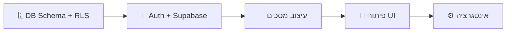

# החלטות ארכיטקטוריות — יתרונות וחסרונות

---

## 1. Admin Dashboard

### אפשרות א': Expo Web (Monorepo משותף)

| | |
|---|---|
| ✅ **יתרונות** | שיתוף קוד מלא (types, Supabase client, components) · repo אחד לתחזק · סגנון אחיד · deploy פשוט (Vercel/Netlify) |
| ❌ **חסרונות** | Expo Web עדיין לא מושלם לדשבורדים עם טבלאות כבדות · RTL ב-web דרך Expo יכול להיות בעייתי · פחות אקוסיסטם של admin components |

### אפשרות ב': Next.js נפרד

| | |
|---|---|
| ✅ **יתרונות** | אקוסיסטם עשיר לדשבורדים (shadcn/ui, TanStack Table) · SSR לביצועים · SEO אם צריך · מוכח ל-admin panels · RTL מצוין |
| ❌ **חסרונות** | repo נפרד או monorepo מורכב יותר · כפילות types (פתיר עם shared package) · שני stacks ללמוד/לתחזק |

### אפשרות ג': Supabase Studio בלבד (ב-MVP)

| | |
|---|---|
| ✅ **יתרונות** | אפס זמן פיתוח · כבר מובנה · מספיק לאימות 50 משלבות ראשונות · מתחילים ליצור ערך מהר |
| ❌ **חסרונות** | לא ניתן לבנות workflow מותאם · לא ניתן למשתמש לא-טכני · חייבים לבנות custom בשלב מסוים |

> [!TIP]
> **המלצה:** אפשרות ג' ל-MVP (אפס השקעה), ואז אפשרות ב' (Next.js) כש-scale דורש. Expo Web לדשבורד admin הוא overkill ולא הכלי הנכון.

---

## 2. UI Kit

### אפשרות א': Tamagui

| | |
|---|---|
| ✅ **יתרונות** | ביצועים מצוינים (compiles to native) · design tokens מובנים · תומך web + native · theming חזק · animations מובנות |
| ❌ **חסרונות** | עקומת למידה תלולה · תיעוד לא תמיד מלא · קהילה קטנה יחסית · debug יכול להיות מאתגר · breaking changes בגרסאות |

### אפשרות ב': NativeWind (TailwindCSS ל-RN)

| | |
|---|---|
| ✅ **יתרונות** | סינטקס Tailwind מוכר ומהיר · תיעוד מצוין · קהילה ענקית · קל ל-AI לייצר קוד · RTL support טוב · className פשוט |
| ❌ **חסרונות** | v4 עדיין חדש — ייתכנו באגים · תלוי ב-Tailwind ecosystem · פחות "native feel" · לא כולל קומפוננטות מוכנות (צריך לבנות/להוסיף) |

### אפשרות ג': React Native Paper (Material Design)

| | |
|---|---|
| ✅ **יתרונות** | קומפוננטות מוכנות ומלאות (buttons, cards, dialogs) · RTL מובנה · accessible · יציב ומוכח · Material Design 3 |
| ❌ **חסרונות** | נראה "Googly" — קשה להתאים לעיצוב ייחודי · customization מוגבל · כבד · פחות גמישות עיצובית · פחות מודרני |

> [!TIP]
> **המלצה:** **NativeWind** — הכי מתאים לפיתוח AI-first. ה-AI מייצר Tailwind מצוין, הסינטקס מהיר, והגמישות העיצובית מלאה. משלימים עם ספריית קומפוננטות כמו `gluestack-ui` או בונים custom.

---

## 3. State Management

### אפשרות א': Zustand

| | |
|---|---|
| ✅ **יתרונות** | פשוט מאוד (5 שורות ל-store) · קל משקל (2KB) · TypeScript מצוין · אין boilerplate · persist middleware מובנה · קל ל-AI |
| ❌ **חסרונות** | אין devtools מתקדמים כמו Redux · פחות מובנה לפרויקטים גדולים מאוד · אין middleware ecosystem עשיר · פחות מוכר לצוותים גדולים |

### אפשרות ב': Redux Toolkit

| | |
|---|---|
| ✅ **יתרונות** | סטנדרט תעשייתי · devtools מצוינים · RTK Query לניהול API · מאוד מובנה · קהילה ענקית · מוכח ב-scale |
| ❌ **חסרונות** | boilerplate רב (slices, actions, reducers) · עקומת למידה · overkill לפרויקט בגודל MVP · קבצים רבים · AI מייצר יותר שגיאות |

### אפשרות ג': TanStack Query בלבד (בלי global state)

| | |
|---|---|
| ✅ **יתרונות** | מתמקד במה שבאמת צריך — server state · caching + refetch אוטומטי · optimistic updates · מצוין עם Supabase · פחות קוד |
| ❌ **חסרונות** | לא פותר client state (UI state, forms) · צריך פתרון משלים · פחות שליטה על flow מורכב |

> [!TIP]
> **המלצה:** **Zustand + TanStack Query** — הצמד המנצח. TanStack Query לכל מה שבא מ-Supabase (server state), Zustand רק ל-client state (UI, filters, auth). מינימום boilerplate, מקסימום ביצועים.

---

## 4. סדר עבודה — תשתית קודם או עיצוב?

> [!IMPORTANT]
> **למערכת הזו, תשתית קודם — וזו הסיבה:**

### למה תשתית ← עיצוב ← פיתוח UI?

| סיבה | הסבר |
|------|-------|
| **מודל הפרטיות מגדיר את ה-UI** | מה שמשלבת רואה ב-TIER 0 שונה מ-TIER 2. אי אפשר לעצב מסכים בלי לדעת מה נחשף בכל שלב. |
| **מנוע ההתאמה מגדיר את ה-Home** | מסך הבית של ההורה הוא פלט האלגוריתם. בלי לדעת מה חוזר — אי אפשר לעצב. |
| **RLS ב-DB מבטיח אבטחה** | אם מתחילים מ-UI ומחברים DB אח"כ — סיכון שנשכח policy. הפוך — ה-DB מגן מהיום הראשון. |
| **Supabase types** | ברגע שה-schema קיים, מייצרים TypeScript types אוטומטית — ה-UI נבנה על טיפוסים אמיתיים. |

### הסדר המומלץ:

1. **שבוע 1** — DB Schema + RLS + Auth + seed data
2. **שבוע 2** — עיצוב מסכים ב-**Stitch** (במקביל: Expo project setup)
3. **שבוע 3+** — פיתוח UI מחובר ל-data אמיתי

---

## 5. עיצוב ב-Stitch — כן, וככה:

Stitch מצוין לפרויקט הזה כי:

| יתרון | הסבר |
|------|-------|
| **מייצר קוד React Native** | לא רק mockup — קוד שאפשר להשתמש בו |
| **עיצוב מסכים מטקסט** | מתאר מסך → מקבל עיצוב עובד |
| **Design System** | יוצרים פעם אחת (צבעים, פונטים, spacing) ומחילים על כל המסכים |
| **איטרציות מהירות** | "תשנה את הכפתור" → שנייה |

### תהליך מוצע עם Stitch:

1. **יצירת Design System** — צבעים (מהמפרט: purple, teal, amber), טיפוגרפיה, רכיבי בסיס
2. **עיצוב 6 מסכי ליבה:**
   - Login / Onboarding
   - Home הורה (התאמות)
   - פרופיל ילד
   - פרופיל משלבת
   - Match flow (בקשה → אישור)
   - Daily log (check-in + שאלון)
3. **ייצוא קוד** → שילוב ב-Expo project

---

## סיכום ההמלצות

| החלטה | המלצה | סיבה עיקרית |
|--------|--------|-------------|
| Admin Dashboard | Supabase Studio ב-MVP → Next.js | אפס השקעה עכשיו |
| UI Kit | **NativeWind** | AI-first, גמישות, מהירות |
| State | **Zustand + TanStack Query** | מינימום boilerplate |
| סדר | **תשתית ← Stitch ← UI** | ה-DB מגדיר מה ה-UI יכול להראות |
