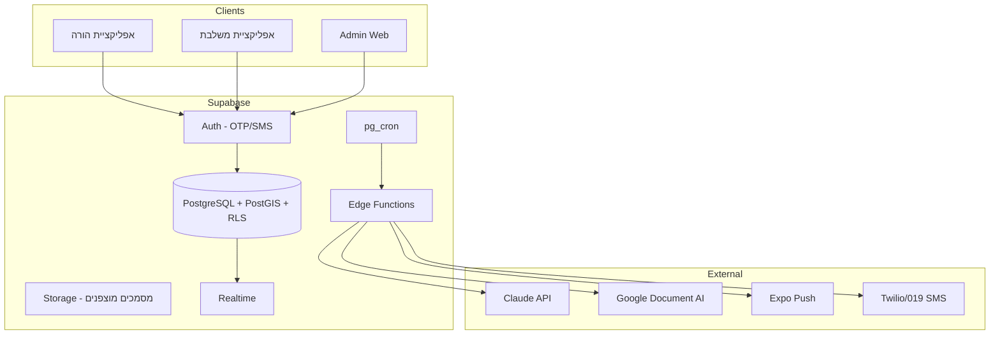

# תכנית פיתוח — פלטפורמת שילוב לילדים עם צרכים מיוחדים

> מסמך זה נגזר מ-`master_spec.html` (גרסה 1.1) ומהווה את תכנית הביצוע הטכנית.
> מסמך חי — מתעדכן ככל שהפיתוח מתקדם.

---

## 1. סיכום הפרויקט

**Together** (שם עבודה) הוא marketplace מסוג B2C שמחבר הורים למשלבות/מטפלות סביב ילד עם צרכים מיוחדים.

| עיקרון | החלטה |
|--------|--------|
| מרכז הכוח | **ההורה** — רואה התאמות, פותח בקשות, מאשר חשיפת מידע |
| Hook ראשוני | מציאת משלבת מתאימה (לא לוח דרושים) |
| Retention | אופרציה יומית — EVV, יומן, תיאום צוות |
| Differentiator | חמ"ל חירום (v1.5) |
| מודל עסקי | B2C פרטי — תמחור סביב ה-match |
| Stack | React Native + Expo · Supabase · Claude API · Google Document AI |

---

## 2. ארכיטקטורה — תמונה כללית



---

## 3. פירוק שלבים — MVP ב-8 שבועות

### שלב 0 — Bootstrap (שבוע 1)
**מטרה:** תשתית שמאפשרת פיתוח מהיר

- [ ] יצירת monorepo: `apps/mobile` (Expo), `apps/admin` (Expo Web / React), `supabase/`
- [ ] Supabase project + extensions: `postgis`, `pg_cron`
- [ ] Auth: OTP ב-SMS (טלפון ישראלי)
- [ ] Design tokens מהמסמך (צבעים, RTL, `--purple`, `--teal` וכו')
- [ ] CI בסיסי: lint, typecheck, Supabase migrations

### שלב 1 — קליטה ואימות (שבועות 2–3)
**מנוע 1 — שומר הסף**

| Epic | פירוט |
|------|--------|
| רישום הורה | טלפון → OTP → פרופיל בסיסי + אזור |
| רישום משלבת | טלפון → OTP → פרופיל מקצועי |
| פרופיל ילד | אבחנה, תפקוד (1/2/3), מסגרת, צרכים (JSONB) |
| העלאת מסמכים | תעודות, תעודת יושר → Storage מוצפן |
| Admin dashboard | תור אימות: OCR (Document AI) + אישור ידני |
| Verified gate | משלבת לא-מאומתת **חסומה לחלוטין** מ-matching |

### שלב 2 — מנוע התאמה (שבועות 3–5)
**מנוע 2 — הלב**

| Epic | פירוט |
|------|--------|
| Hard filters | PostGIS רדיוס · זמינות · מסגרת · שפה · verified=true |
| Soft scoring | Edge Function: ניסיון×3, הכשרות×2, דירוג×2, מרחק×1, ותק×1 |
| מסך בית הורה | "המשלבות שמתאימות ל[שם]" — 3–5 תוצאות + הסבר תאימות |
| Flow בקשה | הורה בוחר → משלבת רואה TIER 0–1 → מגיבה עם מכתב 3–5 משפטים |
| TIER 0–2 RLS | מדיניות ב-DB, לא בקוד |
| Browse משני | משלבת מסמנת "אשמח" — הורה מאשר |

### שלב 3 — אופרציה יומית (שבועות 5–7)
**מנוע 3 — Retention**

| Epic | פירוט |
|------|--------|
| EVV Check-in | GPS geofence של מסגרת, רישום אוטומטי |
| מיקרו-שאלון | אימוג'י מצב רוח + 2–3 מדדים מוגדרים מראש |
| סיכום AI | Edge Function → Claude → סיכום קצר להורה |
| דירוג הדדי | אמינות, מקצועיות, fit — רק אחרי match שהסתיים |

### שלב 4 — Polish + Launch prep (שבוע 8)
- [ ] Seeding: 50+ משלבות מאומתות ב-3 ערים (קריטי ל-cold start)
- [ ] תשלום: עמלת match (החלטה פתוחה — ראה סעיף 7)
- [ ] בדיקות RLS אוטומטיות
- [ ] TestFlight / Internal testing

---

## 4. סכמת DB — ישויות ליבה (MVP)

```sql
-- משתמשים (Supabase Auth + profile)
profiles          → id, role(parent|professional|admin), phone, area, verified

-- ילדים (פרופיל נפרד לכל ילד)
children          → parent_id, first_name, age, diagnoses[], functioning_level,
                    framework_type, needs jsonb, published, location geography

-- מקצוענים
professionals     → user_id, type, specialties[], certifications[],
                    availability jsonb, verified, rating_avg, backup_available

-- התאמות ובקשות
match_requests    → child_id, professional_id, status, cover_letter, tier_reached
matches           → child_id, professional_id, status(active|ended), score, match_reason

-- אופרציה
checkins          → match_id, location geography, created_at
daily_logs        → match_id, date, metrics jsonb, mood, ai_summary
reviews           → match_id, reviewer_role, reliability, professionalism, child_fit

-- אבטחה
audit_log         → user_id, resource, action, tier, created_at
document_uploads  → owner_id, type, storage_path, ocr_status, verified
```

**עקרון מרכזי:** `children` ו-`child_details` מפוצלים — RLS שונה לכל TIER.

### מודל הפרטיות — 4 שכבות (TIER)

| TIER | מתי | מה נחשף |
|------|-----|---------|
| 0 | לפני בקשה (ציבורי) | שם פרטי + גיל, אזור כללי, סוג מסגרת, קטגוריית צורך, שעות |
| 1 | בקשה הוגשה | + אבחנה כללית, רמת תפקוד, תקשורת ורבלית |
| 2 | הורה אישר | + שם מלא, אבחנה מלאה, מה עובד/מקשה, פרטי קשר הורה |
| 3 | match פעיל | תיק ילד מלא לפי בחירת הורה, מסמכים מאושרים, יומן, audit log |

---

## 5. מבנה Repo מומלץ

```
toghther/
├── apps/
│   ├── mobile/          # Expo — הורה + משלבת (role-based routing)
│   └── admin/           # Expo Web — אימות מסמכים
├── packages/
│   ├── ui/              # קומפוננטות משותפות, RTL
│   ├── types/           # TypeScript types מ-Supabase gen
│   └── matching/        # לוגיקת scoring (ניתן לבדיקה)
├── supabase/
│   ├── migrations/
│   ├── functions/       # Edge Functions
│   └── seed.sql         # משלבות לבדיקה
├── master_spec.html
├── DEVELOPMENT_PLAN.md
└── README.md
```

---

## 6. סדר עדיפויות פיתוח

```
1. Auth + Profiles + RLS בסיסי
2. Child profile + Professional profile
3. Admin verification flow
4. Matching engine (hard → soft → UI)
5. Match request flow + TIER policies
6. EVV check-in
7. Daily micro-survey + AI summary
8. Reviews
─────────────── MVP boundary ───────────────
9. Emergency command center (v1.5)
10. Full child dossier TIER 3 (v1.5)
11. Rights navigation module (v2)
```

---

## 7. החלטות פתוחות — לפני קוד

| נושא | אפשרויות | המלצה לשלב מוקדם |
|------|----------|------------------|
| **עמלת match** | תשלום בפתיחת בקשה vs. רק ב-match מוצלח | להתחיל עם **match מוצלח** — פחות חיכוך |
| **שאלון personality** | תוכן עדיין לא מוגדר | **לא ב-MVP** — רק objective + subjective בסיסי |
| **שם המוצר** | Together / Toghther | לאשר עם בעל המוצר |
| **אזורי launch** | 3 ערים | להגדיר (למשל ת"א, חיפה, ב"ש) |
| **ספק תשלומים** | Stripe / PayPlus / Tranzila | PayPlus/Tranzila לשוק ישראלי |

---

## 8. מדדי הצלחה ל-MVP

| מדד | יעד |
|-----|-----|
| משלבות מאומתות | 50+ לפני launch |
| זמן עד 3 התאמות | < 30 שניות |
| RLS | 0 דליפות בבדיקות אוטומטיות |
| Check-in | עובד ב-geofence ±100m |
| Flow מלא | הורה → בקשה → אישור → match פעיל |

---

## 9. סיכונים טכניים — ומענה בפיתוח

1. **RLS מורכב** — לכתוב migration tests עם `supabase test db`
2. **PostGIS** — להגדיר `geography(Point, 4326)` מיום 1
3. **Cold start** — seed script + onboarding ידני ל-50 משלבות לפני beta
4. **עקיפה לוואטסאפ** — EVV + יומן חייבים לעבוד מעולה ב-MVP
5. **מידע רפואי רגיש** — הצפנה ברמת שדה + audit log + revoke מיידי

---

## 10. עלות תשתית — MVP

Supabase Pro ($25) + Expo EAS ($29) + Claude API (~$20) + Document AI (זניח) + SMS (זניח)
= **~$70–100/חודש עד 500 משתמשים**

---

## הצעד הבא

אפשר להתחיל באחד מהבאים:

1. **Bootstrap** — יצירת monorepo, Supabase project, migrations ראשונות
2. **Schema מפורט** — migration SQL מלא עם RLS לכל TIER
3. **Wireframes** — מסכי MVP (הורה / משלבת / admin)
