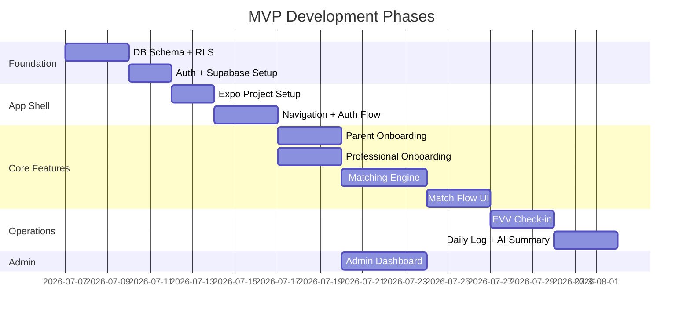

# Together — תוכנית פיתוח פלטפורמת שילוב

פלטפורמת marketplace שמחברת הורים לילדים עם צרכים מיוחדים למשלבות מתאימות, עם מנגנוני התאמה חכמים, ניהול יומי, ומודל פרטיות הדרגתי.

## סיכום המפרט

| פרמטר | ערך |
|--------|------|
| **מודל** | B2C — marketplace פרטי |
| **מרכז הכוח** | ההורה יוזם, המשלבת מגיבה |
| **Stack** | React Native + Expo · Supabase (PostgreSQL) · Claude API |
| **תמחור** | סביב ה-match (Discovery חינם → עמלת match → Plus מינוי) |
| **עלות תשתית MVP** | ~$70–100/חודש עד 500 משתמשים |

---

## User Review Required

> [!IMPORTANT]
> **בחירות ארכיטקטוריות מרכזיות שדורשות אישור לפני תחילת עבודה:**

### 1. מבנה ה-Monorepo
הפרויקט כולל אפליקציית React Native (הורים + משלבות) ו-Admin Dashboard. מוצע:
- **Monorepo עם Expo** — `apps/mobile` + `apps/admin` (Expo Web) + `packages/shared`
- Admin Dashboard כ-Expo Web app (משתף קוד) או Next.js נפרד?

### 2. ניהול State
- **Zustand** (קל, פשוט, מתאים ל-AI-first) או **Redux Toolkit**?
- אני ממליץ על **Zustand** — פשוט, מתועד היטב, מתאים לגודל הפרויקט.

### 3. ניווט
- **Expo Router** (file-based routing, מודרני) — זו הבחירה המומלצת.

### 4. עיצוב ו-UI Kit
- **Tamagui** (native + web, ביצועים טובים) או **NativeWind** (TailwindCSS ל-RN) או **React Native Paper**?
- אני ממליץ על **Tamagui** — ביצועים מצוינים, תומך web, design tokens מובנים.

---

## Open Questions

> [!IMPORTANT]
> **שאלות פתוחות שישפיעו על תוכנית הפיתוח:**

1. **שפת UI** — האפליקציה בעברית בלבד (RTL) ב-MVP, או גם ערבית/אנגלית מהתחלה?
2. **Supabase Project** — יש כבר פרויקט Supabase קיים, או ליצור חדש?
3. **Admin Dashboard** — האם ב-MVP מספיק admin פשוט ב-Supabase Dashboard, או צריך custom UI?
4. **OCR** — האם לשלב Document AI כבר ב-MVP, או שאימות מסמכים ידני (אנושי) מספיק לשלב הראשון?
5. **תשלומים** — באיזה ספק תשלומים להשתמש? (Stripe Israel / Tranzila / PayPlus)
6. **סדרי עדיפויות** — להתחיל לבנות מהמסד נתונים + Auth, או מהעיצוב + UI?

---

## Proposed Changes — MVP Phase

ה-MVP מחולק ל-5 קומפוננטות עיקריות, בסדר בנייה שמייצר ערך בכל שלב:

---

### קומפוננטה 1: תשתית — Supabase + Auth + DB Schema

**מה:** הבסיס של הכל — מסד נתונים, אותנטיקציה, ו-RLS.

#### [NEW] `supabase/migrations/001_initial_schema.sql`
- טבלאות ליבה: `profiles`, `children`, `professionals`, `matches`, `match_requests`
- PostGIS extension להתאמה גיאוגרפית
- JSONB columns לנתונים גמישים (needs, metrics)
- Enum types: `user_role`, `match_status`, `verification_status`, `tier_level`

#### [NEW] `supabase/migrations/002_rls_policies.sql`
- מודל TIER (0–3) מיושם ב-RLS policies
- ההורה שולט — משלבת רואה רק מה שאושר לה
- Audit log trigger לכל גישה ל-TIER 3

#### [NEW] `supabase/migrations/003_functions.sql`
- `calculate_match_score()` — פונקציית scoring
- `get_matches_for_child()` — שליפת התאמות עם hard filters + soft scoring
- `check_in_verify()` — אימות GPS check-in ב-geofence

#### [NEW] `supabase/seed.sql`
- נתוני בדיקה: 10 הורים, 20 ילדים, 30 משלבות, matches לדוגמה

---

### קומפוננטה 2: שלד האפליקציה — React Native + Expo

**מה:** אפליקציית מובייל עם ניווט, אותנטיקציה, ומסכי בסיס.

#### [NEW] `apps/mobile/` — Expo project
- Expo SDK 53 + Expo Router
- RTL support מובנה
- שני flows נפרדים: הורה / משלבת

#### [NEW] `apps/mobile/app/(auth)/`
- מסך כניסה (טלפון + OTP)
- מסך בחירת תפקיד (הורה / משלבת)
- Onboarding flow לכל תפקיד

#### [NEW] `apps/mobile/app/(parent)/`
- **Home** — "המשלבות שמתאימות לנועם" (התאמות אלגוריתמיות)
- **Child Profile** — יצירה ועריכת פרופיל ילד
- **Match Details** — פרטי משלבת + הסבר תאימות
- **Requests** — בקשות פתוחות וסטטוס

#### [NEW] `apps/mobile/app/(professional)/`
- **Home** — בקשות שהתקבלו + ילדים פעילים
- **Profile** — פרופיל מקצועי + תעודות + זמינות
- **Browse** — browse מוגבל של כרטיסים (TIER 0)

#### [NEW] `packages/shared/`
- Types/interfaces משותפים
- Supabase client configuration
- Utils (formatting, validation)

---

### קומפוננטה 3: מנוע ההתאמה (Matching Engine)

**מה:** הלב של הפלטפורמה — "מצאנו לך", לא "חפש בעצמך".

#### [NEW] `supabase/functions/calculate-matches/`
Edge Function שמריצה את האלגוריתם:

**שכבה 1 — Hard Filters:**
- גיאוגרפיה: `ST_DWithin()` ב-PostGIS (רדיוס ק"מ)
- זמינות: חפיפה בין ימים/שעות
- סוג מסגרת: התאמה מדויקת
- שפה: התאמה
- סטטוס אימות: `verified = true` — חובה

**שכבה 2 — Soft Scoring (0–100):**

| פרמטר | משקל | תיאור |
|--------|------|--------|
| ניסיון עם אבחנה | ×3 | ניסיון ספציפי עם סוג האבחנה של הילד |
| הכשרות רלוונטיות | ×2 | קורסים ותעודות מתאימים |
| דירוג הורים | ×2 | ציוני ביקורת ממשפחות קודמות |
| קרבה גיאוגרפית | ×1 | מרחק פיזי (יתרון לקרובה יותר) |
| ותק פלטפורמה | ×1 | זמן פעילות ומספר matches |

**פלט:** 3–5 מועמדות מובילות עם הסבר תאימות לכל אחת.

---

### קומפוננטה 4: אופרציה יומית (Post-Match)

**מה:** מה שמחזיק משתמשים בפלטפורמה ומונע מעבר לוואטסאפ.

#### [NEW] `apps/mobile/app/(active-match)/`
- **Check-in** — GPS-based EVV (geofence של המסגרת)
- **Daily Log** — מיקרו-שאלון פדגוגי (סמלילי רגש + 2–3 מדדים)
- **Child File** — תיק ילד shared (הורה יוצר ושולט, משלבת קוראת)
- **Team** — הזמנת מטפלות חיצוניות + הרשאות

#### [NEW] `supabase/functions/daily-summary/`
- AI (Claude) מנתח את המיקרו-שאלון ומייצר סיכום להורה
- הצעת אסטרטגיה למחר
- Push notification עם הסיכום

---

### קומפוננטה 5: Admin Dashboard

**מה:** ממשק ניהול לאימות מסמכים ומשתמשים.

#### [NEW] `apps/admin/`
- רשימת משלבות ממתינות לאימות
- צפייה במסמכים שהועלו (תעודות, תעודת יושר)
- אישור/דחייה + הערות
- סטטיסטיקות בסיסיות (משתמשים, matches, check-ins)

---

## מבנה תיקיות מוצע

```
toghther/
├── apps/
│   ├── mobile/                # React Native + Expo
│   │   ├── app/               # Expo Router pages
│   │   │   ├── (auth)/        # Login, Register, Onboarding
│   │   │   ├── (parent)/      # Parent screens
│   │   │   ├── (professional)/# Professional screens
│   │   │   ├── (active-match)/# Post-match operations
│   │   │   └── _layout.tsx    # Root layout
│   │   ├── components/        # Shared UI components
│   │   ├── hooks/             # Custom hooks
│   │   ├── stores/            # Zustand stores
│   │   ├── lib/               # Utilities
│   │   └── assets/            # Images, fonts
│   └── admin/                 # Admin dashboard
├── packages/
│   └── shared/                # Shared types, utils, Supabase client
├── supabase/
│   ├── migrations/            # SQL migrations
│   ├── functions/             # Edge Functions
│   ├── seed.sql               # Test data
│   └── config.toml            # Supabase config
├── package.json               # Root workspace
└── master_spec.html           # This spec
```

---

## Verification Plan

### Automated Tests
- `npx jest` — Unit tests למנוע ההתאמה (scoring algorithm)
- `supabase test db` — RLS policies tests (כל TIER נבדק)
- `npx expo lint` — Lint + TypeScript

### Manual Verification
- [ ] רישום כהורה → יצירת פרופיל ילד → צפייה בהתאמות
- [ ] רישום כמשלבת → העלאת מסמכים → אימות ב-admin
- [ ] פתיחת בקשה → אישור משלבת → מעבר TIER
- [ ] Check-in GPS → שאלון יומי → סיכום AI להורה
- [ ] בדיקת RTL על iOS + Android

---

## סדר עבודה מוצע



> [!TIP]
> **המלצה**: להתחיל מ-DB Schema + Auth כי כל השאר תלוי בהם. במקביל אפשר לעבוד על עיצוב ה-UI (Figma / Stitch).
